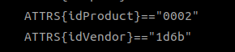

1. usb串口(CH340等)与Ubuntu断开连接

    通过`sudo dmesg -w`查看系统消息
    ```shell
    [24801.910067] usb 1-1.1: new full-speed USB device number 19 using xhci_hcd
    [24802.016166] usb 1-1.1: New USB device found, idVendor=1a86, idProduct=7523, bcdDevice= 2.64
    [24802.016206] usb 1-1.1: New USB device strings: Mfr=0, Product=2, SerialNumber=0
    [24802.016223] usb 1-1.1: Product: USB Serial
    [24802.025038] ch341 1-1.1:1.0: ch341-uart converter detected
    [24802.030366] usb 1-1.1: ch341-uart converter now attached to ttyUSB0
    [24802.679696] input: BRLTTY 6.4 Linux Screen Driver Keyboard as /devices/virtual/input/input26
    [24802.685553] usb 1-1.1: usbfs: interface 0 claimed by ch341 while 'brltty' sets config #1
    [24802.692462] ch341-uart ttyUSB0: ch341-uart converter now disconnected from ttyUSB0
    [24802.692545] ch341 1-1.1:1.0: device disconnected
    ```
    可以看到被一个名为`brltty`的进程终止了。停止`brltty`服务即可
    ```shell
    $ systemctl stop brltty-udev.service
    $ systemctl mask brltty-udev.service
    $ systemctl stop brltty.service
    $ systemctl disable brltty.service
    ```
    再次通过`ls /dev/ttyUSB*`即可查看设备已经存在。
2. 自动赋予特定USB设备权限
    创建udev规则，以ch340串口为例
    ```shell
    $ cd /etc/udev/rules.d
    $ touch ch340.rules
    $ udevadm info -a -n /dev/ttyUSB0
    ```
    找到USB设备的供应商ID和产品ID，如
    
    在ch340.rules文件中填写以下内容，保存
    ```shell
    KERNEL=="ttyUSB*", ATTRS{idVendor}=="1d6b", ATTRS{idProduct}=="0002", MODE:="0777", SYMLINK+="ch340"
    ```
    重启服务
    ```shell
    sudo service udev reload
    sudo service udev restart
    ```
    将USB拔出再插上，`ls -l /dev/ttyUSB*`就可以看到权限已自动修改