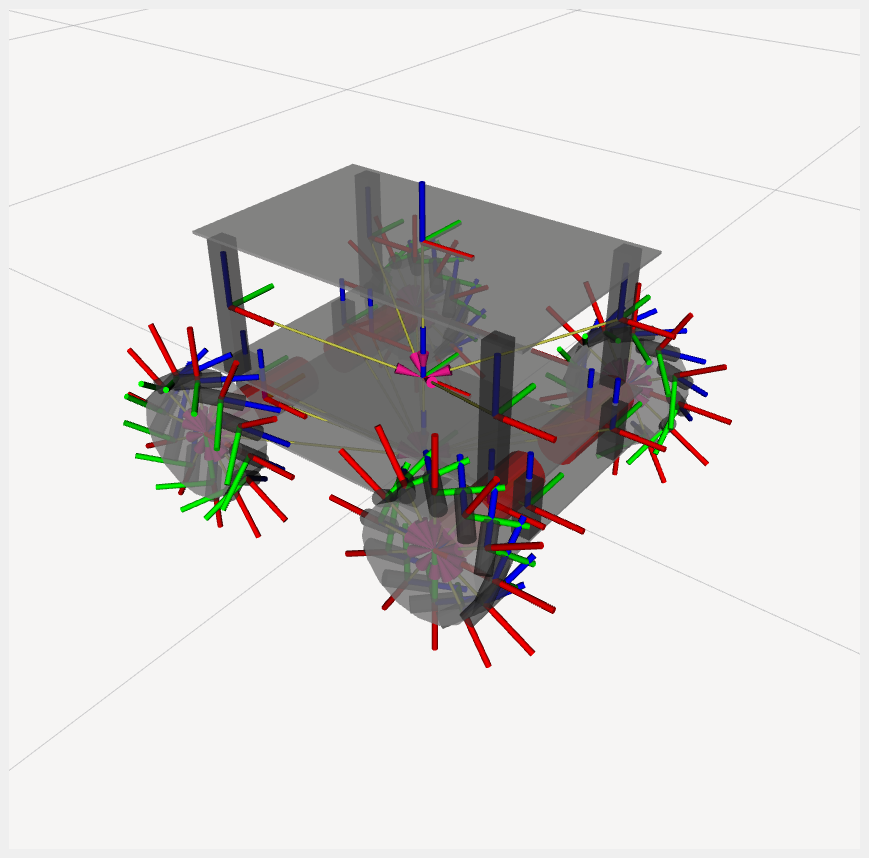
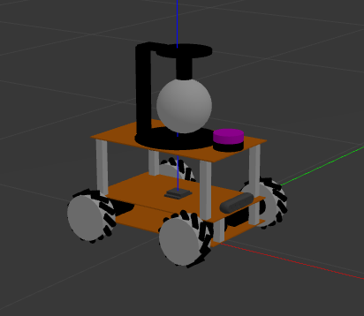
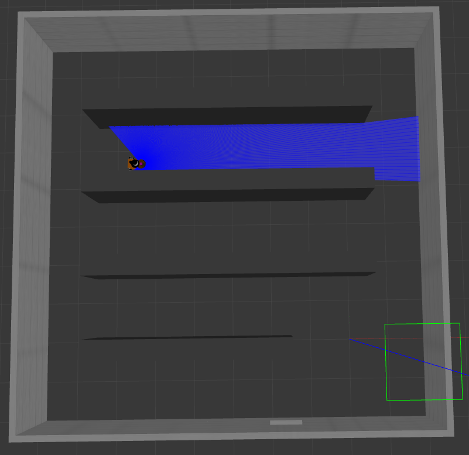
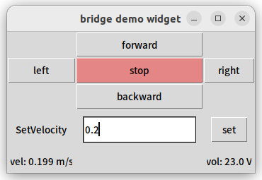

# III-Robot-ROS2

  <p align="center">
    
    
    
  </p>
  <p align="center">Implement the mapping, navigation and positioning of a Mecanum wheel robot in Gazebo.</p>

## Installation
```shell
$ git clone --recursive https://github.com/yunke120/III-Robot-ROS2.git
$ cd III-Robot-ROS2
$ rosdep update
$ rosdep install --from-paths src --ignore-src --rosdistro humble -y
$ colcon build
```

## Visualize the robot
In rviz2
```shell
$ ros2 launch bot_bringup rviz2.launch.py
```
<p align="center">
    
</p>

In gazebo
```shell
$ ros2 launch bot_bringup gazebo_empty_world.launch.py
```
<p align="center">
    
</p>

## Use cartographer to build maps 

shell1
```shell
$ ros2 launch bot_bringup gazebo_substation.launch.py
```
shell2
```shell
$ ros2 launch bot_cartographer bot_cartographer.launch.py
```
shell3
```shell
$ ros2 run bot_teleop teleop_twist_keyboard
```
<p align="center">
    
    
</p>

## Bridge
ros2 communicates with microcontroller STM32

shell 1
```shell
$ ROS_DOMAIN_ID=0
$ colcon build --packages-select bridge
$ source install/setup.bash
$ ros2 run bridge bridge_demo_widget
```
shell 2
```shell
$ ROS_DOMAIN_ID=0
$ colcon build --packages-select micro_ros_setup
$ source install/setup.bash
$ sudo chmod a+rw /dev/ttyACM0
$ ros2 run micro_ros_agent micro_ros_agent serial -b 115200 --dev /dev/ttyACM0
```

<p align="center">
    
</p>


## Reference links
 - [Window SSH Linux](https://elementalgrady.com/posts/ubuntu-2204-enable-ssh/)
 - [Gazebo Materials](http://wiki.ros.org/simulator_gazebo/Tutorials/ListOfMaterials)
 - [qaz9517532846-zm_robot](https://github.com/qaz9517532846/zm_robot.git)
 - [ROBOTIS-GIT-turtlebot3](https://github.com/ROBOTIS-GIT/turtlebot3.git)
 - [Navigation2](https://navigation.ros.org/getting_started/index.html)
