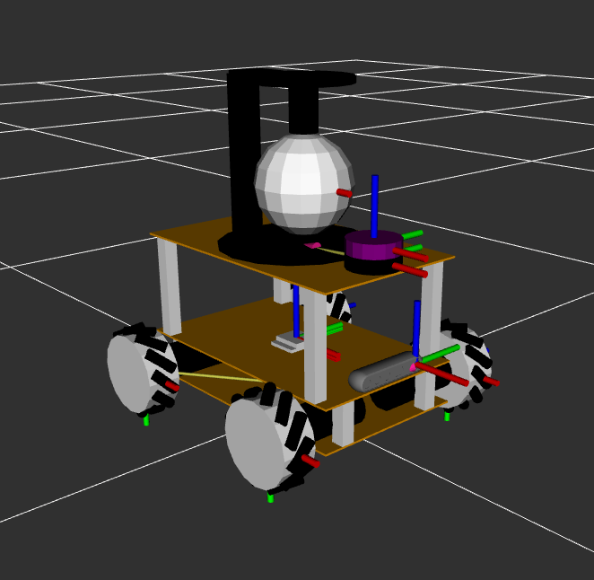

# III-Robot-ROS2

## Getting start

### Visualize the robot
#### In rviz2
```shell
$ ros2 launch bot_bringup rviz2.launch.py
```


In gazebo
```shell
$ ros2 launch bot_bringup gazebo.launch.py
```


### Control the robot
shell 1
```shell
$ ros2 launch bot_bringup gazebo_control.launch.py
```
shell 2
```shell
$ ros2 run teleop_twist_keyboard teleop_twist_keyboard --ros-args -r /cmd_vel:=/diffbot_base_controller/cmd_vel_unstamped
```


## bridge

shell 1
```shell
$ ROS_DOMAIN_ID=0
$ colcon build --packages-select bridge
$ source install/setup.bash
$ ros2 run bridge bridge_demo_widget
```
shell 2
```shell
$ ROS_DOMAIN_ID=0
$ colcon build --packages-select micro_ros_setup
$ source install/setup.bash
$ sudo chmod a+rw /dev/ttyACM0
$ ros2 run micro_ros_agent micro_ros_agent serial -b 115200 --dev /dev/ttyACM0
```


## FAQ
 - [FAQ](./FAQ.md)

## Refer
 - [Window SSH Linux](https://elementalgrady.com/posts/ubuntu-2204-enable-ssh/)
 - [Gazebo Materials](http://wiki.ros.org/simulator_gazebo/Tutorials/ListOfMaterials)
