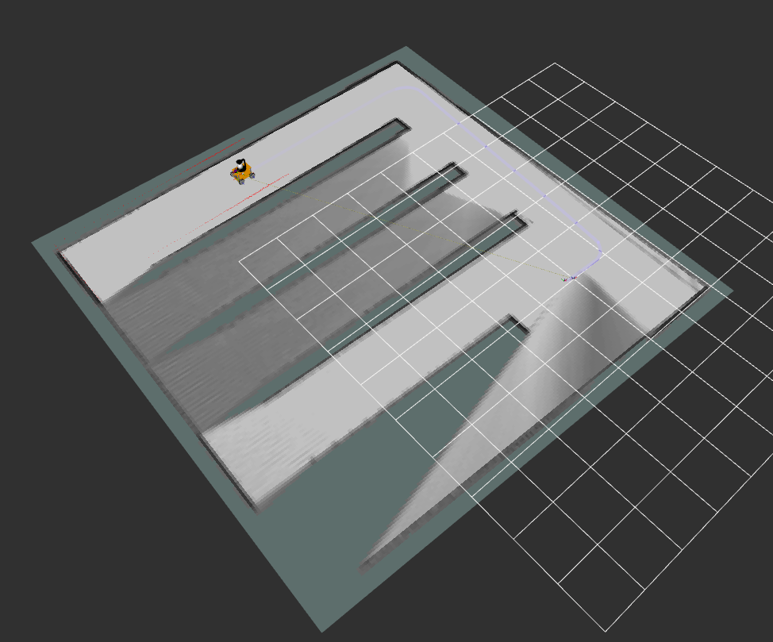

# III-Robot-ROS2

## Getting start

### Visualize the robot
In rviz2
```shell
$ ros2 launch bot_bringup rviz2.launch.py
```
<div align="center">
    
</div>

In gazebo
```shell
$ ros2 launch bot_bringup gazebo_empty_world.launch.py
```

In substation

shell 1
```shell
$ ros2 launch bot_bringup gazebo_substation.launch.py
```
shell 2
```shell
$ ros2 run bot_teleop bot_teleop
```

## Use cartographer to build maps 

shell1
```shell
$ ros2 launch bot_bringup gazebo_substation.launch.py
```
shell2
```shell
$ ros2 launch bot_cartographer bot_cartographer.launch.py
```
shell3
```shell
$ ros2 run bot_teleop teleop_twist_keyboard
```
<div align="center">
    
    
</div>

## bridge

shell 1
```shell
$ ROS_DOMAIN_ID=0
$ colcon build --packages-select bridge
$ source install/setup.bash
$ ros2 run bridge bridge_demo_widget
```
shell 2
```shell
$ ROS_DOMAIN_ID=0
$ colcon build --packages-select micro_ros_setup
$ source install/setup.bash
$ sudo chmod a+rw /dev/ttyACM0
$ ros2 run micro_ros_agent micro_ros_agent serial -b 115200 --dev /dev/ttyACM0
```


## FAQ
 - [FAQ](./FAQ.md)

## Refer
 - [Window SSH Linux](https://elementalgrady.com/posts/ubuntu-2204-enable-ssh/)
 - [Gazebo Materials](http://wiki.ros.org/simulator_gazebo/Tutorials/ListOfMaterials)
